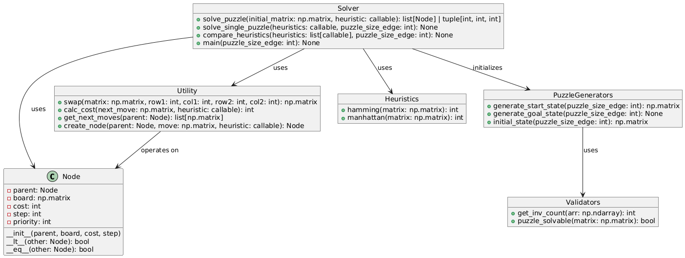

# Ex1: A\* Algorithm implementation

Team members: Haris Kurtagic, Nikyar Karimi, Stefan Wesely

## 1. Task Description

The file implements a sliding puzzle game solver, which can compute solutions using various heuristics like Hamming and Manhattan distances. It supports solving single puzzles and comparing heuristics' performance.

## 2. Software Architecture Diagram

Our Software Architecture includes only one class called Node. It contains various attributes to be used. Further helper functions are implemented. We split these helper functions into boxes for easier organization and understanding, these do not represent another class. Each box groups functions based on their specific roles in the program.

## 3. Module Descriptions

### Node Class:

Represents a single state of the sliding puzzle. It encapsulates the puzzle configuration (board), metadata like cost, step count, and parent node, and provides functionality for comparing and equating states for use in priority queues and search algorithms.

### Functions:

#### Heuristic Functions (`hamming`, `manhattan`):

Provides evaluation metrics for guiding the search algorithm:

- `hamming`: Counts the number of misplaced tiles compared to the goal state.
- `manhattan`: Calculates the sum of distances for each tile from its goal position, offering a more accurate cost for puzzle navigation.

#### PuzzleGenerators (`generate_start_state`, `generate_goal_state`, `initial_state`):

Handles the creation of puzzle states:

- `generate_start_state`: Produces a randomized, shuffled puzzle matrix.
- `generate_goal_state`: Creates the goal configuration where tiles are ordered sequentially.
- `initial_state`: Combines start and goal state generation to initialize the puzzle setup.

#### Validators (`puzzle_solvable`, `get_inv_count`):

Checks the validity of puzzle configurations:

- `get_inv_count`: Calculates the number of inversions in a puzzle, a key metric for determining solvability.
- `puzzle_solvable`: Evaluates whether the puzzle configuration can lead to the goal state based on its inversion count and the position of the blank tile.

#### Solvers (`solve_puzzle`, `solve_single_puzzle`, `compare_heuristics`, `main`):

Implements the main logic for solving puzzles:

- `solve_puzzle`: Uses the A\* algorithm to compute the solution path, guided by a specified heuristic.
- `solve_single_puzzle`: Solves a single instance of a puzzle, displaying the steps or explaining unsolvability.
- `compare_heuristics`: Benchmarks and compares the performance of multiple heuristics over a set of random puzzles.
- `main`: Acts as the program's entry point, allowing the user to select a heuristic or perform heuristic comparisons.

#### Utility Functions (`swap`, `calc_cost`, `get_next_moves`, `create_node`):

Provides supportive functionalities for core operations:

`swap`: Swaps two tiles in a matrix to create a new configuration.
`calc_cost`: Computes the heuristic cost for a given puzzle state.
`get_next_moves`: Generates all possible successor states from the current configuration.
`create_node`: Creates a new node for a specific successor state, associating it with the parent node and heuristic cost.

## 4. Design Decisions

- Python:\
  Python was chosen for its simplicity and readability. NumPy supports efficient matrix and array operations, which were essential for this program.

- Matrix Representation for Puzzle Board State: \
  The sliding puzzle board is represented as a matrix to naturally align with its 2D structure. This choice enables intuitive operations like tile swapping and position calculations. NumPy enhances performance and provides a variety of built-in functions for matrix manipulation.

- Class Representation for Node: \
  The Node class allows efficient tracking of the solution path to the goal. The class-based approach is preferred over a list for better organization, extensibility, and clarity.

- Global Variables for Goal State \
  Using global variables for the goal matrix and cached goal states ensures they remain consistent and accessible throughout the program. This eliminates the need to pass these variables through the whole program and therefore simplifying code.

- Split Between Single Puzzle and Measurement of All Heuristics \
  The workflows for solving a single puzzle and evaluating heuristics over multiple puzzles differ significantly. Separating them simplifies the code and ensures each functionality is optimized for its purpose. Single puzzle solving focuses on finding a solution, while heuristic measurement emphasizes comparative performance metrics.

## 5. Discussions

### Experiences

### Heuristic comparisons

### Possible improvements

- Variable amount of puzzles to get solve path for

- Admissible Heuristic:
- How to see which heuristic is better: Highest cost while still admissible
